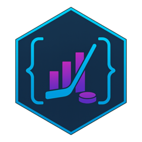

# nhlscraper <a href="https://rentosaijo.github.io/nhlscraper/"></a>
[](https://CRAN.R-project.org/package=nhlscraper)
[](https://github.com/RentoSaijo/nhlscraper)


### Overview

nhlscraper is a minimum-dependency R package to scrape, clean, and visualize NHL data via the NHL and ESPN APIs. It primarily wraps 125+ [endpoints](https://github.com/RentoSaijo/nhlscraper/wiki) from high-level multi-season summaries and award winners to low-level decisecond replays and bookmakers' odds, making them significantly more accessible. It also features cleaning and visualization functions, primarily for play-by-plays, to help analyze the data.

### Prerequisite

- R/RStudio; you can check out my [tutorial](https://youtu.be/hGM1t6usDQ8) if you are not familiar!

### Installation

Install the official version from [CRAN](https://cran.r-project.org) with:
```r
install.packages('nhlscraper')
```

Install the development version from [GitHub](https://github.com/) with:
```r
install.packages('devtools')
devtools::install_github('RentoSaijo/nhlscraper')
```

### Disclosure

Detailed documentation for each scraping function will be released gradually over time. Because each function can return a large amount of information, users are encouraged to explore the provided examples to discover what is available. Most, if not all, of the endpoints accessed by this package are unofficially documented (i.e., hidden), so it is important to use them responsibly and with respect for the NHL’s data servers. Endpoints serving historical or otherwise mostly static data should ideally be queried once and then stored locally (for example, in a MySQL database) for further analysis, rather than being called repeatedly. The exact rate limits for these APIs are not publicly known, so users are asked to avoid excessive or abusive querying to help ensure continued access for everyone.

### History

Prior to the NHL API rework in 2023, Drew Hynes documented a comprehensive list of known [endpoints](https://gitlab.com/dword4/nhlapi/), and several R packages, such as [nhlapi](https://github.com/jozefhajnala/nhlapi) and [hockeyR](https://github.com/danmorse314/hockeyR), were built to access them. However, after the NHL completely transformed its API structure, all of these packages became mostly defunct as their authors understandably chose not to continue maintaining them. The community gathered around work by Zachary Maludzinski to discover and share new [endpoints](https://github.com/Zmalski/NHL-API-Reference), but progress naturally slowed once most of the "main" endpoints were identified. Over the summer of 2025, I began reverse-engineering many of the remaining, undocumented endpoints while searching for additional data for future research, with a particular focus on NHL EDGE and Records data. After I shared those [findings](https://github.com/Zmalski/NHL-API-Reference/issues/69), the effort to expand and refine this map of the APIs accelerated, and together, we ultimately identified 400+ new endpoints that expose a wide range of NHL data. In parallel, I also discovered many new endpoints for the ESPN API, extending beyond what Joseph Wilson had already [compiled](https://github.com/pseudo-r/Public-ESPN-API).
